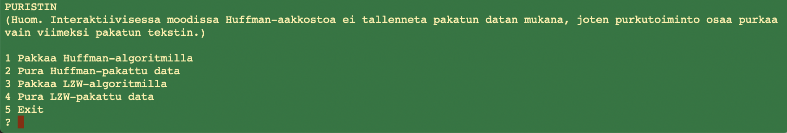

# Käyttöohje

## Asennus ja käyttöönotto

## Interaktiivinen moodi

Jos sovelluksen käynnistää pelkällä komennolla _Puristin_ ilman parametreja, käynnistyy vuorovaikutteinen moodi, jossa pakattavaa/purettavaa dataa voi antaa kirjoittamalla:



Sovellus näyttää pakkauksen tai purun tuloksen suoraan ruudulla ja tarjoaa lisäksi tietoa pakkaussuhteesta ja kuluneesta ajasta. Interaktiivisessa moodissa mitään dataa ei tallenneta pysyvästi minnekään, ja siksi toiminto 2 eli Huffman-purku olettaa, että purettaessa käytetään viimeksi tehdyn Huffman-pakkauksen aakkostoa.

## Komentorivimoodi

Komentorivimoodissa dataa voidaan lukea tiedostoista ja kirjoittaa niihin. Komentorivikäytön syntaksi on seuraava:

```Puristin [huffman|lzw] [pakkaa|pura] <<lähdetiedosto>> <<kohdetiedosto>>```

Komennossa on neljä parametria, joista kaikki ovat pakollisia.
* Ensimmäisellä parametrilla valitaan käytettävä algoritmi, vaihtoehdot `huffman` ja `lzw`.
* Toisella parametrilla valitaan varsinainen toiminto, joko `pakkaa` tai `pura`.
* Kolmannella parametrilla annetaan operaation lähdetiedoston nimi.
* Neljännellä parametrilla annetaan operaation kohdetiedoston nimi. Jos tiedostoa ei ole olemassa, se luodaan. Jos saman niminen tiedosto on jo olemassa, se ylikirjoitetaan.
