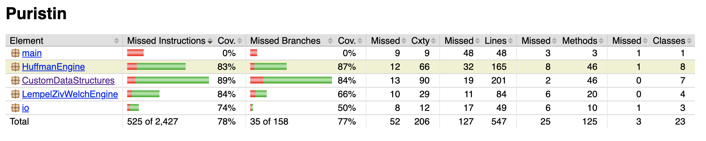

# Testaus

## Yksikkötestaus

Yksikkötestauksen tilanne 24. huhtikuuta: testejä 52 kpl, kaikki menevät läpi. Jacocon laskema testikattavuus alla olevassa kuvassa, tarkempi Jacoco-raportointi löytyy myös repositoriosta. I/O- ja main-paketteja ei toistaiseksi ole yritettykään juuri testata, joten "todellinen" testikattavuus jonkin verran suurempi.

## Suorituskykytestaus

Huffman- ja LZW-pakkauksiin on rakennettu toiminnallisuus, joka mittaa kuluneen ajan mikrosekunteina sekä saavutetun pakkaussuhteen. LZW-pakkauksessa lasketaan lisäksi kaksi eri suhdelukua, todellinen ja "ideaalinen". Nimittäin ajanpuutteen vuoksi LZW:n tiedosto-I/O jouduttiin toteuttamaan Javan short-lukutyypillä eli 16-bittisillä luvuilla, vaikka sisäisesti LZW-avaimille riittää 12 bittiä. Ideaalinen luku laskee, mikä pakkaussuhde olisi, jos myös tiedosto-I/O olisi ehditty toteuttaa 12-bittisenä.

Automaattiset suorituskykytestit löytyvät _Performance_-testipakkauksesta. Ne käyttävät seuraavia testiaineistoja:
* Data 1: Noin 22 kilotavun kokoinen suomenkielinen blogiteksti.

* Data 3: 

||Data 1, JCL |Data 1, custom |Data 2, JCL|Data 2, custom|Data 3, JCL|Data 3, custom
---|---|---|---|---|---|---
LZW, pakkaussuhde (ideaali suluissa) |67,8% (50,9%)|2|3|4|5|6
LZW, pakkausnopeus |12 ms|||||
LZW, purkunopeus |55 ms|||||
Huffman, pakkaussuhde |53,7%|||||
Huffman, pakkausnopeus |39 ms|||||
Huffman, purkunopeus|1913 ms|||||

(Jatkomittauksissa mielenkiintoista nähdä, miten algoritmit eroavat etenkin ajankäytössä, mutta jo tässä vaiheessa epäilen, että Huffmania hidastaa itse tehty ja mahdollisesti tehoton bittijonojen käsittely. LZW on tässä suhteessa "puhtaampi" toteutus. Pitää myös kaivaa lähteitä siitä, miten noiden algoritmien pitäisi "oikeasti" suhteutua toisiinsa.)
