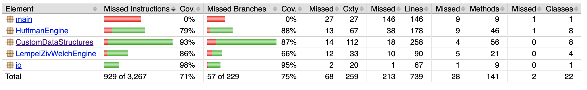

# Testaus

## Yksikkötestaus

Yksikkötestejä on yhteensä 57 kpl. Jacocon laskema testikattavuus alla olevassa kuvassa, tarkempi Jacoco-raportointi löytyy myös repositoriosta. Main-pakettia ei yritettykään testata, joten "todellinen" testikattavuus jonkin verran suurempi.

Yksikkötestauksen lisäksi tehtiin tietysti jatkuvaa integraatio- ja end-to-end -testausta käyttämällä sovellusta eri valmiusasteissa.

## Suorituskykytestaus

Huffman- ja LZW-pakkauksiin on rakennettu toiminnallisuus, joka mittaa kuluneen ajan mikrosekunteina sekä saavutetun pakkaussuhteen. LZW-pakkauksessa lasketaan lisäksi kaksi eri pakkauksen suhdelukua, todellinen ja "ideaalinen". Nimittäin ajanpuutteen vuoksi LZW:n tiedosto-I/O jouduttiin toteuttamaan Javan short-lukutyypillä eli 16-bittisillä luvuilla, vaikka sisäisesti LZW-avaimille riittää 12 bittiä. Ideaalinen luku laskee, mikä pakkaussuhde olisi, jos myös tiedosto-I/O olisi ehditty toteuttaa 12-bittisenä.

Automaattiset suorituskykytestit löytyvät _Performance_-testipakkauksesta. Ne käyttävät seuraavia testiaineistoja:
* Data 1: Noin 22 kilotavun kokoinen suomenkielinen blogiteksti.
* Data 2: Joseph Condardin Heart of Darkness -romaanin ensimmäinen osa, noin 80 kilotavun englanninkielinen teksti.
* Data 3: Merkkijono, jossa toistuu tuhat kertaa teksti _"Tässä olisi vähän tekstiä, toistetaan huomattavan monta kertaa samanlaisena"_.

Oheisessa taulukossa mittaustuloksia. JCL (Java Class Library) mitattiin siinä vaiheessa kun sovellus toimi vielä Javan tarjoamilla tietorakenteilla, custom puolestaan sitten kun ne oli korvattu omilla tietorakenteilla.

||Data 1, JCL |Data 1, custom |Data 2, JCL|Data 2, custom|Data 3, JCL|Data 3, custom
---|---|---|---|---|---|---
LZW, pakkaussuhde (ideaalinen suluissa) |67,8% (50,9%)|sama|66,4% (49,8%)|sama|8,8% (6,6%)|sama
LZW, pakkausnopeus |12 ms|14 ms|24 ms|47 ms|29 ms|108 ms
LZW, purkunopeus |55 ms|80 ms|654 ms|687 ms|62 ms|55 ms
Huffman, pakkaussuhde |53,7%|sama|55,3%|sama|48,4%|sama
Huffman, pakkausnopeus |39 ms|40 ms|63 ms|60 ms|37 ms|33 ms
Huffman, purkunopeus|1913 ms|1845 ms|18785 ms|21621 ms|15301 ms|16358 ms

Selvästi tärkein testihuomio on valtava epäsuhta Huffman-pakkauksen ja -purkamisen kestossa. Purkamisessa on selvästikin jokin bugi, mutta ajanpuutteen vuoksi en ehtinyt paikantaa ja korjata sitä. Huffman-purun kesto näyttää kasvavan eksponentiaalisesti tai muuten räjähtävästi, sillä kun kokeilin aineistoa 3 siten, että merkkijonoa toistettiin tuhannen asemesta kymmenentuhatta kertaa, Huffman-purku oli edelleen käynnissä noin 10 minuutin jälkeen ja oli pakko keskeyttää.

Muita huomioita suorituskyvystä:
* Algoritmit melko tasaväkisiä pakkaussuhteessa. LZW:n heikommat tulokset selittyvät 16-bittisellä tiedosto-I/O:lla. Ja kuten odottaa saattaa, LZW loistaa aineistolla 3, jossa on erittäin paljon toistoa.
* Yllättävää kyllä, omat tietorakenteet eivät juuri hidastaneet toimintaa. Olin varautunut siihen, että Java-ammattilaisten vuosia optimoimat toteutukset pesevät opiskelijatyön mennen tullen. (Toisteisessa datassa eli datassa nro. 3 omat tietorakenteet tosin näyttävät hidastavan LZW-pakkausta huomattavasti. Siellä lienee jokin optimoinnin puute tai rakenteellinen ongelma, joka korostuu toisteisella datalla.)
* Kaikki mittaukset siis tehty "in-memory" eivätkä ota huomioon tiedosto-I/O:n osuutta. Tiedosto-I/O on joka tapauksessa heikosti optimoitu, se on selvää ilman testejäkin, ja tässä vaiheessa testiosaaminen ei olisi ehkä riittänytkään tiedostoliikenteen mittaamiseen.

Kaikkinensa LZW oli paitsi koodimäärältään yksinkertaisempi, myös lopputuloksena onnistuneempi. Jos tästä jokin loppupalaute tulee, olisi mielenkiintoista kuulla, mikä tuossa Huffmanissa oikeastaan meni mönkään.
