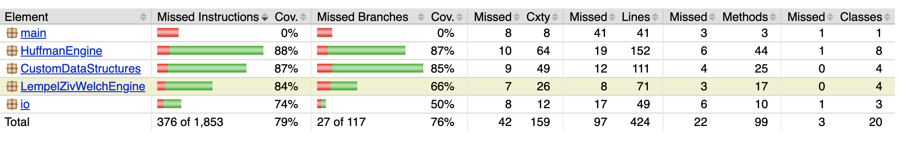

# Testaus

### Yksikkötestaus

Lähes kaikille luokille on luotu JUnit-yksikkötestit, lopuillekin luodaan. Testeissä on tällä hetkellä jonkin verran sellaista vinoumaa, että ne ovat "happy path" -painotteisia eli esim. virheellisiä syötteitä ja erilaisia corner-caseja ei aina testata kattavasti. Tämä tilanne on tarkoitus parantaa projektin valmistumiseen mennessä.

Yksikkötestauksen tilanne 17. huhtikuuta: testejä 30 kpl, kaikki menevät läpi. Jacocon laskema testikattavuus alla olevassa kuvassa, tarkempi Jacoco-raportointi löytyy myös repositoriosta. I/O- ja main-paketteja ei toistaiseksi ole yritettykään juuri testata, joten "todellinen" testikattavuus jonkin verran suurempi.

### Suorituskykytestaus

Suorituskykytestausta tehty toistaiseksi vain epämuodollisesti kellottamalla ja pakatun datan määrää tarkastelemalla. Seuraavaksi luokkiin rakennetaan metodit näiden arvojen laskemiseen, ja samalla otetaan käyttöön joukko erilaisia ja -kokoisia testiaineistoja, jotta suorituskyvystä saadaan tarkempi selko. (Samalla tehdään toteutusdokumentin puolelle muodollisempi aikavaativuusluokkien analyysi.)
